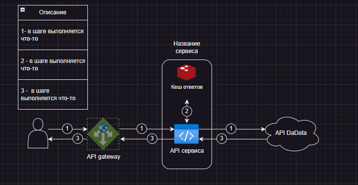

# Название проекта

Краткое описание проекта и его основной функционал.

## Содержание

1. [Архитектура](#архитектура)
2. [Основные компоненты](#основные-компоненты)
2. [Требования к окружению](#требования-к-окружению)
3. [Установка и настройка](#установка-и-настройка)
4. [Запуск и использование](#запуск-и-использование)
5. [Тестирование](#тестирование)
6. [Swagger](#swagger-документация)
7. [Мониторинг и логирование](#мониторинг-и-логирование)
8. [Обновление и обслуживание](#обновление-и-обслуживание)
9. [Контакты](#контакты)
10. [DevOps](#devops)

## Архитектура

Описание архитектуры проекта, включая диаграммы и описание основных компонентов.




## Основные компоненты

Текущий репозиторий

## Требования к окружению

Go 1.20

### Переменные окружения

Описание переменных окружения, используемых в проекте, и их значений по умолчанию.

| Переменная  | Описание                        | Значение по умолчанию |
|-------------|---------------------------------|-----------------------|
| HOST        | порт поднятия сервиса           | `:4379`               |
| SERVER_NAME | имя сервиса                     | `template_service`    |
| SENTRY_DSN  | sentry dsn                      | `default_value`       |
| SENTRY_ENV  | sentry environment              | `default_value`       |
| LOG_LEVEL   | Минимальный уровень логирования | `info`                |
| TLS_KEY     | путь до                         | `/path/to/tls/key`    |
| TLS_PEM     | путь до                         | `/path/to/tls/pem`    |


## Установка и настройка

собрать приложение ```./cmd/app/main.go```

## Запуск и использование

```go build -o app ./cmd/app/main.go```
```./app```

## Тестирование

Отсутствует

## Swagger документация

```./docs```

## Мониторинг и логирование

Sentry

## Обновление и обслуживание

Нет особенностей

## Контакты

TODO

## Инструкции по ведению веток

https://wiki.rusklimat.ru/pages/viewpage.action?pageId=101630916

## Инструкция по code revew

** Добавить ссылку **<br>
[WEB Code review](https://wiki.rusklimat.ru/pages/viewpage.action?pageId=79597639)

## Требования ИБ к разрабатываемым сервисам

** Добавить ссылку **

## DevOps

Метод ```/ping``` находится по адресу  ```/api/ping```